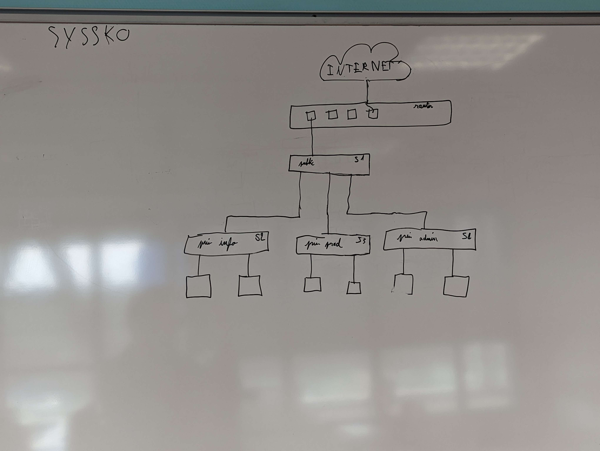

# Synthèse de la SAE 5B.01 "Évolution d'une infrastructure" - Mathilde Cléret

## Table des matières

---

[TOC]

## Présentation du projet et de l'équipe

Le projet consiste à installer l'infrastructure d'une entreprise fictive. Notre infrastructure possède un réseau public et un réseau privé qui contiennent chacun des postes physiques, des spécificités techniques ainsi que différents services.

Pour réaliser ce projet, l'établissement ainsi que les professeurs concernés, mon mis à disposition une salle de travail où se trouve des ordinateurs sur le réseau de l'IUT. De plus j'ai à disposition du matériel afin de maquetter l'infrastructure de l'entreprise, c'est à dire, une baie informatique, des postes physiques, plusieurs switch, un commutateur, des Raspberry, de nombreux câbles et du matériel supplémentaire est disponible sur demande.

> Pour plus d'informations concernant le sujet du projet, veuillez-vous référer au README ainsi qu'aux différents fichiers du projet disponibles sur le GIT-LAB de l'université de Lille.  

Mon groupe est l'équipe B.  Il est composée de 4 membres (mathilde.cleret.etu, cyriac.faubert.etu, guerric.lepretre.etu et mattieu.seneschael.etu). Mon entreprise est nommée SYSSKO, ce qui a permis de créer notre DNS: "syssko.iut". Ce DNS permettra aux deux autres groupes chargés de créer leur propre infrastructure, de communiquer sur notre réseau public. De plus, un groupe est chargé de mettre en place le FAI (*fournisseur d'accès à Internet*). Ce groupe nous a communiqué la tranche d'adresse IP que nous devons utiliser afin d'assurer une bonne communication entre l'infrastructure réseau de chaque groupe. 

> La collaboration au sein de l'équipe pour la conception et la réalisation de ce projet a présenté certains défis, tant sur le plan technique que social. 
>
> Malgré les obstacles rencontrés, j'ai participée à la mise en place de plusieurs services de l'infrastructure et réfléchis, avec mes camarades, aux aspects techniques et réseaux du projet.
>
> De plus, j'ai concentrer mes efforts sur la synthèse du projet que voici.
>
> Il est important de souligner que bien que nos approches aient différé, notre travail a convergé vers un projet unifié, résultat d'une collaboration de groupe.

Sur les nombreuses recommandations de M. Beaufils ainsi que sur nos propres expériences, nous avons voulu mettre en place un système permettant de sauvegarder et de réinstaller très rapidement les différents services et configurations de notre infrastructure. De cette façon notre travail ne sera pas impacté en cas de problème physique ou réseau.

Mon équipe a donc décidé de déployer l'intégralité des services sur des fichiers vagrant, dans l'idée de pouvoir déployer notre infrastructure rapidement et de façon illimitée. Malheureusement, cette solution c'est vite avérée très limité. Mais suite à des désaccords d'équipe, aucune autre solution n'a été envisagée.  **Il est donc indispensable pour les projets futurs ou pour des étudiants reprenant ce projet de trouver une solution alternative ou une solution complémentaire.**

Voici une liste des différents points bloquants que j'ai pu relever sur cette solution:

- Cette solution ne permettant pas une sauvegarde des configurations  matériels, tel que les switch, le commutateur ou encore les différents câblages; ces configurations ont été "sauvegardées" sous forme de liste de commandes et/ou de photos. Il est donc difficile de se retrouver dans les nombreux documents et la restauration de l'infrastructure n'est plus rapide ni efficace.
- Les fichiers vagrant ne sont pas l'idéal pour la mise en place de certains services. En effet, certaines mises en place demandent l'écriture de plusieurs fichiers de configurations, de choix en mode graphique ou encore de liens avec d'autres services. Ces problèmes peuvent être contournés mais l'écriture des fichiers vagrant devient chronophage et ralentit énormément le reste du travail. De plus certains fichiers vagrant ne fonctionnent, parfois, plus lors d'un nouveau déploiement ou d'utilisation sur un autre ordinateur.  De ce fait, cette solution fait perdre beaucoup de temps à nouveau.
- Les fichiers vagrant ne permettent pas d'utiliser les adresses IP de notre choix dû à certaines configurations. Cela complique la mise en place du réseau de notre infrastructure. 
- Suite aux choix de quelques personnes sur les noms des VM configurées dans les fichiers vagrant ou pour le nommage des fichiers, il est facile de s'y perdre sur l'utilité de chaque fichier. Cela ralentit de nouveau le déploiement de l'infrastructure qui est sensé être rapide et pratique.
- Lorsque chaque personne crée son propre fichier vagrant pour le service qu'il tente de mettre en place, il écrit, peu, voir pas de commentaire ou de documentation. De ce fait, il est quasiment impossible pour les autres membres de l'équipe de comprendre le travail réalisé ou d'y apporter des modifications. Il est donc nécessaire que le créateur du fichier soit présent et réexplique à chaque personne le fichier selon ce qu'il se souvient. Ce procédé n'est guère productif et n'aide pas au développement  des connaissances des étudiants. *Ce qui est pour moi, l'essence même de la mise en place d'un projet: pouvoir développer ses compétences et connaissances d'une nouvelle façon.*  

## Réseau, routage et câblage

### Réseau de l'infrastructure de notre "entreprise"

L'infrastructure réseau de notre entreprise fictive a été longuement réfléchie pour répondre aux besoins spécifiques du sujet. L'objectif étant de séparer les flux de données publics de ceux privés tout en assurant une connectivité et une sécurité optimales.

**Partie Publique :**

La partie publique du réseau est composée de quatre serveurs, avec des adresses IP accessibles par toutes les autres organisations extérieures.

- **Kyanite (10.10.10.25) - Serveur DNS :**
  La machine *"Kyanite"* joue le rôle de serveur DNS autorité, permettant la résolution du nom de domaine attribués à notre organisation.

- **Topaze (10.10.10.26) - Serveur Email :**
  La machine *"Topaze"* est le serveur dédié à la gestion des emails pour le domaine de notre organisation. Il assure la communication interne et externe.

- **Péridot (10.10.10.27) - Serveur Web :**
  La machine *"Péridot"* hébergera le futur site web de l'entreprise, offrant un accès en ligne pour les utilisateurs externes.

- **Quartz (10.10.10.28) - Pare-feu :**
  La machine *"Quartz"* sécurise la partie publique du réseau en agissant comme un pare-feu. Elle garantit la protection des ressources internes en filtrant le trafic indésirable tout en permettant une communication autorisée vers et depuis les réseaux publics.

**Partie Privée :**

La partie privée est divisée en plusieurs sous-réseaux, chaque sous-réseau étant dédié à un service spécifique au sein de l'organisation.

1. **Réseau Informatique (192.168.60.0/24) :**
   - **Labradorite (192.168.60.10) - Serveur DHCP :** La machine *"Labradorite"* assure la distribution dynamique des adresses IP aux machines du réseau informatique, simplifiant la gestion des adresses au sein de l'organisation.
   - **Opale (192.168.60.20) - Serveur LDAP :** La machine *"Opale"* héberge le service LDAP qui définit les utilisateurs et groupes, facilitant l'authentification et les autorisations au sein du réseau informatique.
   - **Iolite (192.168.60.30) - Serveur NFS :** La machine *"Iolite"* stocke les données des utilisateurs du réseau informatique, fournissant un service de stockage centralisé via NFS.
   - **Calcédoine (192.168.60.40) - Proxy Web :** La machine *"Calcédoine"* agit en tant que proxy web, contrôlant et filtrant l'accès à Internet depuis le réseau informatique.

2. **Réseau Administratif (192.168.70.0/24) :**
   - **PC1-A (192.168.70.10) et PC2-A (192.168.70.20) :** Ces stations de travail dans le réseau administratif sont équipées d'un navigateur web et d'un outil de gestion des emails, fournissant aux employés du service administratif les outils nécessaires à leurs tâches quotidiennes.

3. **Réseau Production (192.168.80.0/24) :**
   - **PC1-P (192.168.80.10) et PC2-P (192.168.80.20) :** Ces stations de travail dans le réseau de production sont destinées aux salariés du secteur de la production, offrant également les fonctionnalités de navigation web et de gestion des emails.

La sécurité est renforcée au sein des réseaux privés par l'intermédiaire du pare-feu Quartz,  tout en permettant une communication entre les différents services internes et serveurs publics.

### Routage entre les différentes machines de l'organisation

Une partie de mes camarades se sont chargés de la configuration des Routeurs et des Switch après que l'équipe se soit mise d'accord sur l'organisation du réseau de infrastructure de notre entreprise fictive.

#### Configuration du Routeur R1:

1. **`R1>enable`** : Active le mode privilégié.
2. **`R1#configure terminal`** : Accède au mode de configuration globale du routeur R1.
3. **`R1(conf)#interface vlan10`** : Configuration des paramètres pour l'interface virtuelle (VLAN) 10.
4. **`R1(conf-if)#ip address 10.10.10.25 255.255.255.248`** : Attribue manuellement une adresse IP statique (10.10.10.25 avec un masque de sous-réseau de 255.255.255.248) à l'interface VLAN 10.
5. **`R1(conf-if)#exit`** : Quitte le mode de configuration de l'interface spécifique (VLAN 10) pour revenir au mode de configuration globale.
6. **`R1(conf)#interface vlan40`** : Configuration de l'interface virtuelle (VLAN) 40.
7. **`R1(conf-if)#ip address dhcp`** : Obtient dynamiquement une adresse IP pour l'interface VLAN 40 via le protocole DHCP.
8. **`R1(conf)#interface Fastinternet0`** : Configuration des paramètres pour l'interface FastEthernet0.
9. **`R1(conf-if)#switchport access vlan 10`** : Configure l'interface FastEthernet0 pour utiliser le VLAN 10 en mode d'accès.
10. **`R1(conf)#interface Fastinternet1`** : Configuration des paramètres pour l'interface FastEthernet1.
11. **`R1(conf-if)#switchport access vlan 40`** : Configure l'interface FastEthernet1 pour utiliser le VLAN 40 en mode d'accès.
12. **`R1(conf-if)#exit`** : Quitte le mode de configuration de l'interface spécifique pour revenir au mode de configuration globale.
13. **`R1(conf)#interface Fasteternet4`** : Configuration des paramètres pour l'interface FastEthernet4
14. **`R1(conf-if)#ip address dhcp`** : Obtient dynamiquement une adresse IP pour l'interface FastEthernet4 via le protocole DHCP.

#### Configuration du Routeur R2:

1. **`R2>enable`** : Active le mode privilégié.
2. **`R2#configure terminal`** : Accède au mode de configuration globale du routeur R1.
3. **`R2(conf)#interface vlan10`** : Configuration des paramètres pour l'interface virtuelle (VLAN) 10.
4. **`R2(conf-if)#ip address 10.10.10.25 255.255.255.248`** : Attribue manuellement une adresse IP statique (10.10.10.25 avec un masque de sous-réseau de 255.255.255.248) à l'interface VLAN 10.
5. **`R2(conf-if)#exit`** : Quitte le mode de configuration de l'interface spécifique (VLAN 10) pour revenir au mode de configuration globale.
6. **`R2(conf)#interface vlan40`** : Configuration de l'interface virtuelle (VLAN) 40.
7. **`R2(conf-if)#ip address dhcp`** : Obtient dynamiquement une adresse IP pour l'interface VLAN 40 via le protocole DHCP.
8. **`R2(conf)#interface Fastinternet0`** : Configuration des paramètres pour l'interface FastEthernet0.
9. **`R2(conf-if)#switchport access vlan 10`** : Configure l'interface FastEthernet0 pour utiliser le VLAN 10 en mode d'accès.
10. **`R2(conf)#interface Fastinternet1`** : Configuration des paramètres pour l'interface FastEthernet1.
11. **`R2(conf-if)#switchport access vlan 40`** : Configure l'interface FastEthernet1 pour utiliser le VLAN 40 en mode d'accès.
12. **`R2(conf-if)#exit`** : Quitte le mode de configuration de l'interface spécifique pour revenir au mode de configuration globale.
13. **`R2(conf)#interface Fasteternet4`** : Configuration des paramètres pour l'interface FastEthernet4
14. **`R2(conf-if)#ip address dhcp`** : Obtient dynamiquement une adresse IP pour l'interface FastEthernet4 via le protocole DHCP.

#### Configuration du Switch S1:

1. **`vlan 10`** : Crée un VLAN avec l'ID 10.
2. **`name public`** : Donne le nom "public" au VLAN 10.
3. **`interface FastEthernet0/1`** : Configure les paramètres pour l'interface FastEthernet0/1.
4. **`switchport access vlan 10`** : Configure l'interface FastEthernet0/1 pour utiliser le VLAN 10 en mode d'accès.
5. **`interface FastEthernet0/24`** : Configure les paramètres pour l'interface FastEthernet0/24.
6. **`switchport trunk allowed vlan 1-5,10-40`** : Autorise les VLAN 1 à 5 et 10 à 40 sur l'interface en mode trunk.
7. **`switchport mode trunk`** : Configure l'interface en mode trunk.
8. **`interface Vlan10`** : Configure les paramètres pour l'interface Vlan10.
9. **`ip address 10.10.10.25 255.255.255.248`** : Attribue une adresse IP statique (10.10.10.25 avec un masque de sous-réseau de 255.255.255.248) à l'interface Vlan10.

### Câblage de la baie qui nous a été attribuée en physique

Nos branchements ont été, à plusieurs reprises, enlevés ou modifiés. Nous avons donc créé un schéma et pris des photos au fur et à mesure que nous faisions évoluer notre câblage, afin de pouvoir reprendre notre travail le plus rapidement possible.

Voici le schéma et le câblage final:


Ci-dessous le schéma de notre toute première version du câblage de notre infrastructure:



## Services mis en place

### DHCP

Le DHCP (*Dynamic Host Configuration Protocol*) est un protocole réseau dont le rôle est d’assurer la configuration automatique des paramètres IP d’une machine, notamment en lui attribuant automatiquement une adresse IP et un masque de sous-réseau.

Nous avons configurés trois sous-réseaux (subnets) différents, chacun avec sa propre plage d'adresses IP attribuables et ses paramètres de configuration réseau spécifiques.

1. **Subnet 192.168.60.0 (réseau Informatique):**
   
   - **Netmask (masque de sous-réseau) :** 255.255.255.0 (ce qui signifie qu'il s'agit d'un sous-réseau de classe C avec 256 adresses possibles).
   - **Plage d'adresses IP attribuables aux clients :** De 192.168.60.3 à 192.168.60.254.
   - **Serveurs de noms de domaine :** ns1.syssko.iut et ns2.syssko.iut.
   - **Nom de domaine :** "syssko.iut".
   - **Route par défaut (gateway) :** 192.168.60.1.
   - **Adresse de diffusion :** 192.168.60.255.
   - **Durée de bail par défaut :** 600 secondes.
   - **Durée de bail maximale :** 7200 secondes.
   
2. **Subnet 192.168.70.0 (réseau Administratif):**
   
   - **Netmask :** 255.255.255.0.
   - **Plage d'adresses IP attribuables aux clients :** De 192.168.70.3 à 192.168.70.254.
   - **Serveurs de noms de domaine :** ns1.syssko.iut et ns2.syssko.iut.
   - **Nom de domaine :** "syssko.iut".
   - **Route par défaut :** 192.168.70.1.
   - **Adresse de diffusion :** 192.168.70.255.
   - **Durée de bail par défaut :** 600 secondes.
   - **Durée de bail maximale :** 7200 secondes.
   
3. **Subnet 192.168.80.0 (réseau Production):**
   
   - **Netmask :** 255.255.255.0.
   - **Plage d'adresses IP attribuables aux clients :** De 192.168.80.3 à 192.168.80.254.
   - **Serveurs de noms de domaine :** ns1.syssko.iut et ns2.syssko.iut.
   - **Nom de domaine :** "syssko.iut".
   - **Route par défaut :** 192.168.80.1.
   - **Adresse de diffusion :** 192.168.80.255.
   - **Durée de bail par défaut :** 600 secondes.
   - **Durée de bail maximale :** 7200 secondes.
   
   > La durée de bail (*lease time*) est la durée pendant laquelle le client est autorisé à utiliser l'adresse IP allouée avant de devoir renouveler sa demande de bail.

### LDAP

Le protocole *Lightweight Directory Access Protocol (LDAP)* est un protocole de communication standard utilisé pour accéder à des services d'annuaire informatique de manière légère (simplicité et efficacité du protocole par rapport à son prédécesseur, le protocole X.500). 

Un service d'annuaire est une base de données qui stocke et organise des informations sur des ressources réseau, telles que des utilisateurs, des groupes, des périphériques, etc.

LDAP fonctionne sur le modèle client-serveur, où un client LDAP envoie des requêtes à un serveur LDAP pour accéder aux informations de l'annuaire.

L'annuaire LDAP organise les données selon une structure hiérarchique appelée *Directory Information Tree (DIT)*. Cela ressemble à un arbre, avec une racine et des branches. Chaque élément dans l'arbre est appelé une "entrée". Chacune de ces entrées représente une entité dans l'annuaire, comme un utilisateur, un groupe ou un périphérique. Chaque entrée a un identifiant unique appelé *Distinguished Name (DN)* qui indique sa position dans la hiérarchie.

Voici l'annuaire que nous avons mis en place lors du projet:


### NFS

Le NFS (*Network File System*) est un protocole qui permet à un ordinateur d'accéder via un réseau à des fichiers distants.

Voici les principale étapes de la configuration du système avec un ensemble RAID, l'exportation des répertoires via NFS (*Network File System*) et la configuration des partages Samba.

Un ensemble RAID (*Redundant Array of Independent Disks*) est une technique qui consiste à combiner plusieurs disques durs physiques en une seule unité logique

NFS est principalement utilisé dans les environnements Unix/Linux, tandis que Samba est compatible avec les systèmes Windows. En utilisant ces deux protocoles, nous essayont d'avoir un accès partagé aux fichiers à partir de différentes plates-formes.

1. **`mdadm --create /dev/md0 --level=5 --raid-devices=3 /dev/sdb /dev/sdc /dev/sdd --spare-device=1 /dev/sde`**: Création  d'un ensemble RAID de niveau 5 (`--level=5`) avec trois périphériques de données (`/dev/sdb`, `/dev/sdc`, `/dev/sdd`) et un périphérique de rechange (`--spare-device=1 /dev/sde`). L'ensemble RAID est nommé `/dev/md0`.
2. **`mkfs.ext4 /dev/md0`**: Création d'un système de fichiers ext4 sur le nouvel ensemble RAID (`/dev/md0`).
3. **`mkdir /home/RAID`**: Création d'un répertoire `/home/RAID` qui sera utilisé comme point de montage pour l'ensemble RAID.
4. **`echo "/home   192.168.60.0/24(rw,root_squash,no_subtree_check)" >> /etc/exports`**: Configuration de l'exportation NFS du répertoire `/home` avec certaines options spécifiques pour les clients dans le sous-réseau 192.168.60.0/24 (réseau Informatique).
5. **`echo "/var/share/public       192.168.60.0/24(ro,all_squash,no_subtree_check)" >> /etc/exports`**: Configuration de l'exportation NFS du répertoire `/var/share/public` en lecture seule pour les clients dans le sous-réseau 192.168.60.0/24 (réseau Informatique).
6. **`echo "/var/share/public       192.168.70.0/24(ro,all_squash,no_subtree_check)" >> /etc/exports`**: Configuration de l'exportation NFS du répertoire `/var/share/public` en lecture seule pour les clients dans le sous-réseau 192.168.70.0/24 (réseau Administratif).
7. **`echo "/var/share/public       192.168.80.0/24(ro,all_squash,no_subtree_check)" >> /etc/exports`**: Configuration de l'exportation NFS du répertoire `/var/share/public` en lecture seule pour les clients dans le sous-réseau 192.168.80.0/24 (réseau Production).
8. **`echo "/var/share/root         192.168.60.50(rw,no_root_squash,no_subtree_check)" >> /etc/exports`**: Configuration de l'exportation NFS du répertoire `/var/share/root` en lecture-écriture pour le client avec l'adresse IP 192.168.60.50, sans effectuer le remappage du compte root.
9. **`mkdir /var/share`, `mkdir /var/share/root`, `mkdir /var/share/public`**: Création des répertoires qui seront partagés via NFS.
10. **`mkdir /srv/samba`, `mkdir /srv/samba/public_ro`, `mkdir /srv/samba/public_rw`, `mkdir /srv/samba/public_full`**: Créations des répertoires pour les partages Samba.

### Gestion des mails

Pour la gestion des mails, nous avons décidé d'utiliser **Postfix**. C'est un serveur de messagerie électronique libre. Il permet la livraison de courriels et il est connu comme une alternative plus rapide, plus facile à administrer et plus sécurisé que la plupart des autres serveurs de messageries.

Postfix présente plusieurs avantages. Il dispose de plusieurs "systèmes" qui permettent une gestion des pourriels efficace ainsi que la possibilité de déléguer la gestion des courriels à un processus externe (sous la forme d'un démon ou d'un programme externe lancé à chaque courriel reçu, qui exécute des règles définies dans "*/etc/postfix/main.cf*" et "*/etc/postfix/master.cf*"). De plus, Postfix reçoit régulièrement des mises à jour de sécurité.

Le fichier "*/etc/postfix/main.cf*" est la configuration principale du serveur de messagerie Postfix. Il contient de nombreuses options qui définissent le comportement global du serveur. Voici quelques configurations de base que nous avons du comprendre et/ou modifier dans ce fichier :

- **myhostname = mail.syssko.iut**

  Définit le nom d'hôte du serveur de messagerie. Cela peut être le FQDN (*Fully Qualified Domain Name*) du serveur. 

- **mydomain = syssko.iut**

  Indique le domaine par défaut pour les adresses électroniques générées par Postfix.

- **myorigin = $mydomain**

  Détermine le domaine à utiliser comme origine pour les courriers sortants générés par le serveur.

- **inet_interfaces = all**

  Spécifie les interfaces réseau sur lesquelles Postfix doit écouter les connexions entrantes. "all" signifie que le serveur écoute sur toutes les interfaces disponibles.

- **inet_protocols = ipv4**

  Indique quels protocoles réseau sont utilisés pour écouter les connexions. Ici, nous avons choisi "ipv4" car nous nous sommes uniquement concentré sur l'IPv4 pour le moment.

- **mydestination = $myhostname, $mydomain, localhost.$mydomain, localhost**

  Définit les domaines pour lesquels le serveur est responsable. Les courriers destinés à ces domaines sont traités localement. Ici, nous avons gardé la configuration par défaut.

- **mynetworks = 127.0.0.0/8, 192.168.60.40/24**

  Spécifie les réseaux qui sont autorisés à relayer du courrier à travers le serveur. Dans notre configuration, les adresses IP 127.0.0.0/8 (localhost) et 192.168.60.40/24 (Proxy Web) sont autorisées.

- **mailbox_size_limit = 0**

  Fixe la taille maximale des boîtes aux lettres. La valeur "0" signifie illimité.

### Firewall linux

Pour notre firewall linux j'ai décidée d'utiliser **Iptables** car en plus d'être très simple d'utilisation il est déjà intégré sur les systèmes linux. De plus, pour changer une règle il suffit d'entrer la ligne de commande correspondante et le firewall prend en compte les changements effectués. Cela rend l'utilisation d'Iptables rapide et efficace.

Iptables est un outil de filtrage de paquets  qui permet de configurer les règles de pare-feu pour contrôler le flux de données réseau. Il est utilisé pour définir des règles qui spécifient comment les paquets réseau doivent être traités, que ce soit en les autorisant, les bloquant ou en les redirigeant.

Voici une synthèse du fonctionnement d'Iptables:

1. **Tables :** Iptables utilise des "tables" pour organiser les règles. Les tables les plus couramment utilisées sont *filter*, *nat*, et *mangle*. Chacune de ces tables est responsable d'un aspect spécifique du traitement des paquets.

2. **Chaînes :** Chaque table contient des "chaînes" (chains), qui sont des listes de règles. Les chaînes définissent différentes étapes du traitement des paquets, comme l'acceptation, le rejet ou la modification.

3. **Règles :** Les règles sont les instructions spécifiques définies dans une chaîne. Chaque règle indique à Iptables comment traiter un paquet en fonction de certains critères tels que l'adresse IP source ou de destination, le port, etc.

4. **Politiques par défaut :** Chaque chaîne a une "politique par défaut", qui spécifie ce qui doit être fait si aucun des critères des règles n'est satisfait. Par exemple, on peut définir la politique par défaut d'une chaîne pour accepter, rejeter ou ignorer le trafic.

5. **Actions :** Les actions définissent ce qui doit être fait avec un paquet qui correspond à une règle. Les actions courantes incluent l'acceptation (`ACCEPT`), le rejet (`DROP`), le renvoi (`FORWARD`), et d'autres actions spécifiques aux tables.

Le fichier de configuration d'Iptables suivant a été généré par 'iptables-save'. Il définit les règles de filtrage de paquets pour le pare-feu sur notre système Linux. Voici les règles que nous avions ajouté et leur signification :

```*filter
:INPUT DROP [0:0]
:FORWARD DROP [0:0]
:OUTPUT ACCEPT [0:0]
```

- INPUT DROP [0:0]: Par défaut, le trafic entrant est rejeté. Aucun paquet n'a encore été accepté ou rejeté (les chiffres entre crochets sont les compteurs du nombre de paquets et de bytes)
- FORWARD DROP [0:0]: Par défaut, le trafic en transit (forward) est rejeté
- OUTPUT ACCEPT [0:0]: Par défaut, le trafic sortant est accepté

```-A INPUT -i lo -j ACCEPT
-A OUTPUT -o lo -j ACCEPT
```

- Les deux règles ci-dessus autorisent le trafic local

```
-A INPUT -m conntrack --ctstate ESTABLISHED,RELATED -j ACCEPT
```

- Autorise les connexions établies et liées

```
-A INPUT -p tcp --dport 22 -j ACCEPT
```

- Autorise le trafic TCP sur le port 22 (SSH) 

```
-A INPUT -s 192.168.60.0/24 -d 192.168.70.0/24 -j ACCEPT
```

- Autorise le trafic provenant de 192.168.60.0/24 (service Informatique) à destination de 192.168.70.0/24 (service Administratif)

```
-A INPUT -s 192.168.70.0/24 -d 192.168.80.0/24 -j ACCEPT
```

- Autoriser le trafic provenant de 192.168.70.0/24 (service Administratif) à destination de 192.168.80.0/24 (service Production)

```
*nat
:POSTROUTING ACCEPT [0:0]
-A POSTROUTING -o eth0 -j MASQUERADE
```

- POSTROUTING ACCEPT [0:0]: Par défaut, toutes les règles de translation d'adresses réseau (NAT) en sortie sont acceptées. Puis la règle suivante effectue la translation d'adresse masquée (MASQUERADE) sur l'interface eth0 pour le trafic sortant

## Extensions

> Les extensions n'ont malheureusement pas eu le temps de voir le jour. Cependant, je me suis renseignée sur la compréhension de ces éléments ainsi que sur les différents moyens de les mettre en place. De cette façon, j'ai pu approfondir mes connaissances et ces éléments qui pourront être déployés plus facilement et plus rapidement en cas d'une suite ou une reprise du projet par d'autres étudiants.

### IPV4 et IPV6

- **DHCP**

  Il existe un protocole qui permet une configuration automatique des paramètres IPV6. Ce protocole se nome **DHCPv6** (*Dynamic Host Configuration Protocol version 6*).

  Il existe une autre méthode (plus simple) pour la configuration automatique des paramètres IPV6. Cette méthode se nome **SLAAC** (*Stateless Automatic Auto Configuration*) et elle ne requiert pas de serveur DHCP. 

  Nous allons nous focaliser sur DHCPv6 afin de respecter les exigences du sujet. 

  Il existe deux versions de DHCPv6 : avec et sans état. Un protocole sans état (*stateless protocol*) est un protocole de communication qui n'enregistre pas l'état d'une session de communication entre deux requêtes successives. C'est à dire que chaque paire requête-réponse est traitée comme une transaction indépendante, sans lien avec les requêtes précédentes ou suivantes. A contrario, un protocole qui impose la conservation des informations sur l'état interne du serveur est appelé protocole avec état (*stateful* *protocol*).

  Les deux versions de DHCPv6 présentent chacune leurs avantages et inconvénients. Il me semble intéressant de s'orienter vers celui avec état. En effet, si une interruption se présente, le contexte et l'historique sont stockés et la reprise sera plus facile. De plus, la majorité des applications que nous utilisons au quotidien sont des applications "stateful", il peut donc être intéressant de mieux comprendre le fonctionnement de ce type de protocole.

  *Ci dessous, une représentation du fonctionnement de DHCPv6 lors de l'attribution d'une adresse IPV6.*

  

  La configuration de DHCPv6 est fortement similaire à la configuration de DHCP. Il s'agit donc de procéder en trois étapes. Pour commencer, il est recommandé d'établir sa table d’adressage (⚠️ il faut indiquer les adresses des appareils en IPV6). Par la suite, il faut configurer le matériel nécessaire (commutateur / switch), pour cela les commandes requises sont semblables à celles pour DHCP en IPv4. De nombreux exemples et documentations sont disponibles sur internet. Une fois ces étapes réalisés, il ne reste plus qu'à vérifier le bon fonctionnement du service. 

- **LDAP**

  LDAP peut prendre en paramètres des adresses IPV6. Aucune installation ou mise en place particulière n'est requise. Il suffit donc de renseigner des adresses IPV6 lors de la configuration de LDAP.

- **NFS**

  NFS est compatible avec IPv6 sur la plupart des systèmes. Il s'agit, simplement, de renseigner des adresses IPV6 lors de la configuration de NFS. 

  ⚠️ Veuillez vérifier la compatibilité de NFS en IPV6 sur le système utilisé. La liste des systèmes compatibles se trouve facilement sur internet. Pour le système utilisé lors de cette SAE (Debian), il n'y as aucun problème de compatibilité.

- **Gestion des mails** 

  Postfix supporte le protocole IPv6 depuis sa version *2.2* sur certains systèmes (dont *Linux 2.4+*). Il n'y a donc pas de problème de compatibilité sur les machines utilisées lors de cette SAE.  La liste des systèmes compatibles se trouve facilement sur internet.

  Cependant plusieurs configurations sont nécessaires afin d'assurer le bon fonctionnement de Postfix en IPv6. Il s'agit de deux nouveaux paramètres de configuration dans (*main.cf*) et une modification de la syntaxe de notation des adresses. 

  - Un des nouveaux paramètres est *inet_protocols*. Il indique lequel des protocoles Postfix doit être utiliser pour établir ou accepter des connexions réseau. Il indique également quels types de consultations DNS Postfix doit utiliser.

    > ```
    > /etc/postfix/main.cf:
    >     # Vous devez arrêter et redémarrer Postfix après avoir changer ce paramètre
    >     inet_protocols = ipv4       (DÉFAUT: n'active qu'IPv4)
    >     inet_protocols = all        (active IPv4 et IPv6 s'il est supporté)
    >     inet_protocols = ipv4, ipv6 (active IPv4 et IPv6)
    >     inet_protocols = ipv6       (n'active qu'IPv6)
    > ```

    Par défaut, Postfix n'utilise qu'IPv4, car la plupart des systèmes ne sont pas raccordés à un réseau IPv6.

  - L'autre paramètre est *smtp_bind_address6*. Il indique l'adresse d'interface locale utilisée pour les connexions IPv6 sortantes (comme *smtp_bind_address* pour IPv4).

    > ```
    > /etc/postfix/main.cf:
    >     smtp_bind_address6 = [2001:240:587:0:250:56ff:fe89:1]
    > ```

  - ⚠️  Il faut indiquer les adresses IPv6 entre crochet "`[]`" dans les valeurs des paramètres de *main.cf* et dans les autres fichiers de configuration afin d'éviter que Postfix confonde les adresses IPv6 avec d'autres types de valeurs à cause de la présence du caractère ":" dans les adresses IPv6.

  - Plusieurs limitations de l'utilisation de Postfix en IPv6 sont connues et peuvent provoquer des erreurs ou des ralentissements. Voici quelques une de ces limitations:

    - L'ordre des tentatives de connexions sortantes IPv6/IPv4 n'est pas configurable. IPv6 est testé avant IPv4.
    - Postfix ne supporte pas les consultations DNSBL (*DNS Black Listing* - listes noires en temps réel) pour les adresses clientes IPv6.
    - Certains paramètres de configuration en IPv4 changent "d'utilité" en IPv6 et peuvent compliquer l'utilisation de Postfix en IPv6.

- **Firewall linux**

L'utilisation d'Iptables pour la configuration du pare-feu en IPv6 est possible grâce à ip6tables. Les règles et la syntaxe sont similaires à ceux utilisées pour IPv4, il suffit de taper ```ip6tables``` au lieu de ```iptables``` lors de la configuration du firewall en ligne de commande. 

⚠️ Penser à bien entrer les adresses en IPv6

### VPN

La mise en place d'un VPN semble plutôt complexe d'après mes recherches. Voici, cependant, les étapes que l'on devrait suivre pour la mise en place du VPN:

#### 1. Choix du protocole VPN :

   - Les protocoles **OpenVPN** ou **IKEv2** semblent être deux solutions simples et sécurisées pour l'installation d'un VPN sous linux. 

     *Ci-dessous, un rapide comparatif des différents VPN les plus répandus:*


> Quelque que soit le VPN qui sera mis en place, il est recommandé de lire la documentation officiel avant de ce lancer dans la configuration.
>
> OpenVPN 2.4: https://openvpn.net/community-resources/reference-manual-for-openvpn-2-4/
>
> IKEv2: https://wiki.strongswan.org/projects/strongswan/wiki/UserDocumentation
>
> ⚠️**ATTENTION à bien sélectionner la version du VPN installée!**

#### 2. Configuration du VPN :

   - Mettre en place le serveur VPN qui gère les connexions entrantes et sortantes.
   - S'assurer que le serveur VPN est situé dans la partie publique de notre réseau.

   - Attribuer un pool d'adresses IP VPN distinct pour les utilisateurs se connectant au réseau privé.

     - Service Informatique :

          - Utiliser des sous-réseaux distincts pour les services informatiques et administratifs.

          - Configurer les règles du pare-feu pour permettre le trafic nécessaire entre les réseaux.
     
     - Service Administratif :
           - Isoler le réseau administratif du réseau informatique en utilisant des règles de pare-feu appropriées.


#### 3. Configuration du VPN Client :

   - Distribuer les configurations VPN aux utilisateurs autorisés.
   - Utiliser des certificats ou des identifiants de connexion pour renforcer la sécurité.

#### 4. Gestion des accès :

   - Mettre en place un système d'authentification forte pour l'accès VPN.
   - Enregistrer et surveiller les *log*s pour détecter les activités suspectes.

### Accès Wifi

La mise en place d'un accès WiFi dans notre "entreprise" implique d'évaluer les besoins en termes d'utilisateurs, de bande passante et de couverture. Il faut choisir du matériel professionnel adapté, planifier l'installation et configurer le réseau avec des paramètres de sécurité robustes selon le matériel choisi.


