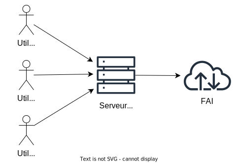

# Le caching proxy

Le caching proxy est une mise en cache qui réduit la bande passante et améliore les temps de réponse en mettant en cache et en réutilisant les pages web fréquemment visitées.

## Squid

Squid est un logiciel de caching proxy qui offre ces fonctionnalités et plus.

Ce serveur cache se place sur le réseau privé des utilisateurs faisant parti à l'équipe de production. Il fera office d'intermédiaire avec les réseaux publics des autres organisations.

De cette manière, tout les utilisateurs d'un même réseau passent par un proxy cache. Les fichiers téléchargés par un utilisateur sont enregistrés dans le cache proxy. Si un autre utilisateur demande les mêmes fichiers, ils seront récupérés depuis le cache proxy permettant un accès plus rapide pour les utilisateurs.

