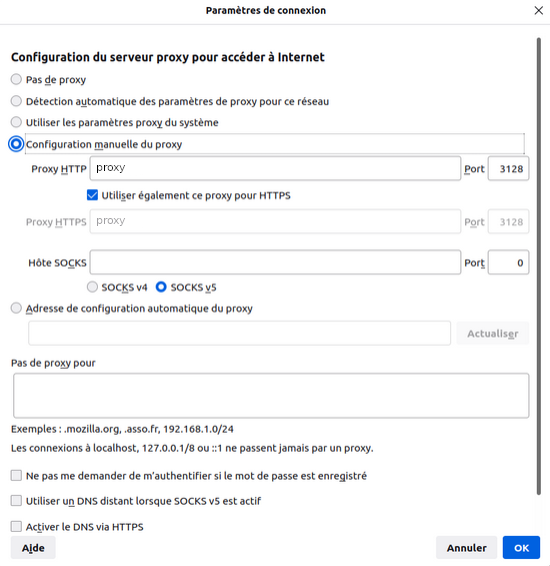

<head>
<link rel="stylesheet" href="css/style.css">
</head>

# Le caching proxy

Le caching proxy est une mise en cache qui réduit la bande passante et améliore les temps de réponse en mettant en cache et en réutilisant les pages web fréquemment visitées.

## Squid

Squid est un logiciel de caching proxy qui offre ces fonctionnalités et plus.

Ce serveur cache se place sur le réseau privé des utilisateurs faisant parti à l'équipe de production. Il fera office d'intermédiaire avec les réseaux publics des autres organisations.

De cette manière, tout les utilisateurs d'un même réseau passent par un proxy cache. Les fichiers téléchargés par un utilisateur sont enregistrés dans le cache proxy. Si un autre utilisateur demande les mêmes fichiers, ils seront récupérés depuis le cache proxy permettant un accès plus rapide pour les utilisateurs.

|  | 
|:--:| 
| *Image simplifiée du réseau intégrant le proxy* |

## Installation de Squid

L'installation de Squid est simple:

    apt install squid

Le fichier de configuration /etc/squid/squid.conf est créé. Il contient beaucoup de lignes de commentaires, on peut donc utiliser cette commande pour afficher les lignes non commentées:

    grep -vE "^(#|$)" /etc/squid/squid.conf

On obtient cette configuration:

<details>
<summary>/etc/squid/squid.conf sans commentaires</summary>
<p>
acl localnet src 0.0.0.1-0.255.255.255  # RFC 1122 "this" network (LAN)
<br>
acl localnet src 10.0.0.0/8             # RFC 1918 local private network (LAN)
<br>
acl localnet src 100.64.0.0/10          # RFC 6598 shared address space (CGN)
<br>
acl localnet src 169.254.0.0/16         # RFC 3927 link-local (directly plugged) machines
<br>
acl localnet src 172.16.0.0/12          # RFC 1918 local private network (LAN)
<br>
acl localnet src 192.168.0.0/16         # RFC 1918 local private network (LAN)
<br>
acl localnet src fc00::/7               # RFC 4193 local private network range
<br>
acl localnet src fe80::/10              # RFC 4291 link-local (directly plugged) machines
<br>
acl SSL_ports port 443
<br>
acl Safe_ports port 80          # http
<br>
acl Safe_ports port 21          # ftp
<br>
acl Safe_ports port 443         # https
<br>
acl Safe_ports port 70          # gopher
<br>
acl Safe_ports port 210         # wais
<br>
acl Safe_ports port 1025-65535  # unregistered ports
<br>
acl Safe_ports port 280         # http-mgmt
<br>
acl Safe_ports port 488         # gss-http
<br>
acl Safe_ports port 591         # filemaker
<br>
acl Safe_ports port 777         # multiling http
<br>
http_access deny !Safe_ports
<br>
http_access deny CONNECT !SSL_ports
<br>
http_access allow localhost manager
<br>
http_access deny manager
<br>
include /etc/squid/conf.d/*.conf
<br>
http_access allow localhost
<br>
http_access deny all
<br>
http_port 3128
<br>
coredump_dir /var/spool/squid
<br>
refresh_pattern ^ftp:           1440    20%     10080
<br>
refresh_pattern ^gopher:        1440    0%      1440
<br>
refresh_pattern -i (/cgi-bin/|\?) 0     0%      0
<br>
refresh_pattern .               0       20%     4320
</p>
</details>

Voici une liste des directives utilisés par défaut et leur utilitées:

    La directive http_port spécifie l'adresse et le port d'écoute de Squid. Squid écoute par défaut sur toutes les interfaces réseau au port 3128.

    La directive coredump_dir indique le répertoire où Squid peut enregistrer les fichiers core (ce sont les fichiers d'erreurs).

    Les directives refresh_pattern définissent les règles pour déterminer si un fichier est considéré comme "frais" ou "périmé". Un fichier "périmé" est retiré du cache.

    Les directives acl et http_access permettent d'autoriser ou d'interdire les connexions HTTP.

Il n'y a aucune spécification sur les restrictions qu'il devrait y avoir pour le proxy, on va donc laisser les paramètres par défaut donnés par Squid.

Il faudra par la suite changer le proxy web des différents utilisateurs en l'ajoutant sur leur navigateur web:

|  | 
|:--:| 
| *Changement du proxy à partir du navigateur web* |


Il est également possible de modifier la configuration du proxy de la machine cliente en lignes de commande : 

```
root@client:~$ export http_proxy="http://ip_proxy:port"
root@client:~$ export https_proxy="http://ip_proxy:port"
```
